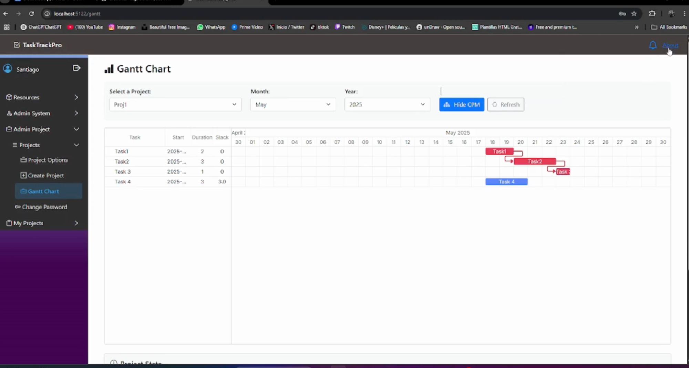

# TaskManager

Aplicación fullstack de gestión de proyectos y tareas: creación de proyectos, asignación de recursos, cálculo automático de **ruta crítica (CPM)** y visualización en **diagrama de Gantt**.

Este proyecto es el entregable del obligatorio de **Diseño de Aplicaciones 1** (Universidad ORT Uruguay, 2025), desarrollado en dos entregas a lo largo del semestre. La consigna pedía diseñar e implementar un sistema de gestión de proyectos con roles de usuario, control de recursos compartidos y cálculo de camino crítico, aplicando principios de diseño orientado a objetos (SOLID, TDD, arquitectura en capas) de punta a punta.



*Diagrama de Gantt de un proyecto de ejemplo, con la vista de CPM activada. Las tareas en rojo (Task1 → Task2 → Task3) forman la ruta crítica: tienen slack 0, así que cualquier retraso en ellas atrasa el proyecto entero. Task4, en azul, tiene 3 días de holgura.*

---

## Qué hace

- **Gestión de proyectos**: creación de proyectos con miembros, tareas y un líder de proyecto opcional.
- **Gestión de tareas** con dependencias: cada tarea puede tener tareas previas y tareas simultáneas, con recursos asociados de uso exclusivo o concurrente.
- **Cálculo de ruta crítica (CPM)**: fechas tempranas y tardías, holgura (*slack*) y determinación automática de qué tareas son críticas — es decir, cuáles no pueden retrasarse sin afectar la fecha de fin del proyecto.
- **Diagrama de Gantt** interactivo, con la ruta crítica resaltada en rojo.
- **Resolución de conflictos de recursos**: si un recurso ya está comprometido en el rango de fechas pedido, el sistema busca automáticamente la próxima fecha disponible (o permite forzar la asignación).
- **Roles y permisos**: administrador de sistema, administrador de proyecto, líder de proyecto y miembro, con hasta cuatro roles simultáneos por usuario.
- **Notificaciones** a los miembros de un proyecto ante cambios relevantes.
- **Exportación** de proyectos a CSV y JSON.
- **Panel de disponibilidad de recursos** con calendario visual (Full Calendar).

---

## Arquitectura

El proyecto sigue una **arquitectura en capas** clásica, separando responsabilidades en seis proyectos de .NET:

```
Domain          → entidades del dominio y sus reglas (Task, Project, User, Resource, Notification)
DataAccess      → repositorios y persistencia (Entity Framework Core + SQL Server)
Service         → lógica de negocio, DTOs, validaciones, cálculo de CPM
Controllers     → capa intermedia entre el front-end y los servicios
Interface       → front-end en Blazor
*.Test          → un proyecto de tests por cada capa de backend
```

El front-end (Blazor) nunca accede a las entidades de dominio directamente: todo pasa por controllers que dependen de servicios, y los servicios traducen entre entidades de dominio y DTOs. Esto mantiene el modelo de dominio desacoplado de la representación que ve el usuario.

**Evolución entre entregas:** la primera entrega usaba una clase `InMemoryDatabase` que instanciaba todos los repositorios de una vez, aunque no se fueran a usar, y los exponía como propiedades públicas — cualquier servicio tenía acceso a todos los repositorios, y cambiar el almacenamiento implicaba tocar varias clases. En la segunda entrega esto se reemplazó por:

- Una interfaz `IRepositoryManager` con **lazy loading**: cada repositorio se crea solo cuando un servicio lo pide por primera vez.
- Migración completa a **Entity Framework Core sobre SQL Server** (antes, listas en memoria), con `OnModelCreating` configurando claves, relaciones muchos-a-muchos (usuarios↔notificaciones, proyectos↔miembros) y conversiones de tipos como enums a string.
- Interfaces para cada repositorio y cada servicio, para que las clases dependan de abstracciones (DIP) y se puedan extender sin modificar código existente (OCP).

---

## Decisiones y patrones de diseño

- **Excepciones personalizadas por dominio**: en vez de `ArgumentException` genérica, cada entidad tiene su propia jerarquía de excepciones (`TaskException` → `TaskTitleException`, `TaskResourceException`, etc.), con mensajes específicos. Esto hace los tests más expresivos y los errores más fáciles de diagnosticar.
- **Exporter con Template Method + Strategy**: una clase abstracta `ExporterBase` centraliza la validación de entrada y el ordenamiento de proyectos; `CSVExporter` y `JSONExporter` solo implementan el formateo específico. Agregar un `PDFExporter` no requeriría tocar el código existente.
- **CPM como servicio independiente**: `CpmService` calcula fechas tempranas/tardías, slack y ruta crítica en base a una lista de tareas con dependencias, sin conocer nada de la UI ni de la persistencia — se testeó con TDD de forma aislada, incluyendo casos de dependencias complejas y listas vacías.
- **Resolución de conflictos de recursos por fuerza bruta controlada**: al crear una tarea, si el recurso pedido no está disponible en la fecha solicitada, el sistema busca día por día la próxima fecha libre. Documentado explícitamente como una decisión consciente («no van a haber casos de uso masivos») en vez de una limitación no analizada.

### Deuda técnica reconocida

La documentación de la segunda entrega es honesta sobre dos problemas que no se llegaron a resolver por tiempo:

- Una página Blazor (`ProjectList`, ~1800 líneas) concentra todas las operaciones sobre proyectos, violando SRP. La solución identificada (no implementada) era dividirla en componentes especializados con *state services* y `CascadingParameter` para comunicarlos.
- La clase `User` del dominio tiene alto acoplamiento: está relacionada con roles, tareas, proyectos y notificaciones a la vez. Se identificó que una clase intermedia (`NotificationUser`) reduciría ese acoplamiento, pero el cambio no se hizo por el impacto que tenía en el resto de los servicios ya cerca de la entrega.

---

## Testing

- **TDD estricto** con ciclo Red-Green-Refactor, reflejado en el historial de commits (`red: ...`, `green: ...`, `refactor: ...`).
- **90%+ de cobertura** en Domain, DataAccess y Service (medido con coverage de .NET; las migraciones de EF quedan excluidas).
- Sin tests directos sobre Controllers: actúan como intermediarios delgados hacia Service, y esa lógica ya está cubierta en los tests de servicio.
- Pruebas funcionales de alta/baja/modificación grabadas en video (ver Documentación).

---

## Stack

**Backend:** C# · .NET 8 · Entity Framework Core
**Base de datos:** SQL Server (vía Docker)
**Frontend:** Blazor Server
**Testing:** MSTest, TDD (Red-Green-Refactor)
**Librerías externas:** DHTMLX Gantt (diagrama de Gantt, offline), Full Calendar (panel de disponibilidad de recursos), Bootstrap (UI e iconos)

---

## Cómo levantarlo

Requiere .NET 8 SDK y Docker (para SQL Server).

```bash
docker compose up -d      # levanta SQL Server
dotnet run --project Interface
```

---

## Documentación

- [Informe final (segunda entrega)](Docs/Informe_Entrega2_Final.pdf) — arquitectura completa, UML, migración a Entity Framework, exportadores, resolución de conflictos de recursos y mejoras identificadas.
- [Informe de la primera entrega](Docs/Informe_Entrega1.pdf) — versión inicial del sistema, como referencia de la evolución del proyecto.
- [Demo en video](https://youtu.be/D0FBlK4BS7Q) — pruebas funcionales de alta, baja y modificación.

---

## Equipo

Proyecto desarrollado en equipo de tres para el obligatorio de Diseño de Aplicaciones 1 (Universidad ORT Uruguay, 2025).
